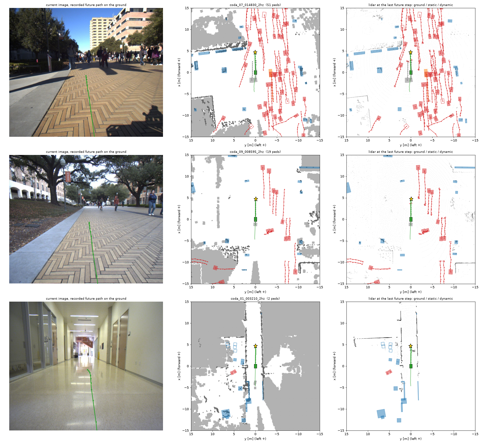

# qwen_robotics_open_dataset

Converts robot social-navigation datasets into image-in, trajectory-out navigation scenarios with
3D ground truth, and scores predicted trajectories for collisions. The intended use is evaluating
humanoid navigation policies open-loop.

Each scenario is **10 past frames + current + 10 future frames**:

- **input:** front-camera images of the past and current frames, plus the robot's own past positions;
- **ground truth:** the robot's recorded future trajectory, and for the current and every future frame
  the 3D boxes of labelled objects (static or dynamic) and a lidar point cloud tagged
  ground / static / dynamic, in the style of the Waymo Open Dataset.

Data (one Hugging Face dataset per source; each card documents columns, frames and limitations):

- CODa: <https://huggingface.co/datasets/Jinyan0924/qwen_robotics_open_dataset>
- RoboSense: <https://huggingface.co/datasets/Jinyan0924/qwen_robotics_open_dataset_robosense>



## Status

| Source | Status | Notes |
|---|---|---|
| CODa (UT Campus Object Dataset) | converted | 10 Hz labels. 1,955 scenarios at 2 Hz (5 s + 5 s), 2,603 at 10 Hz (1 s + 1 s) |
| RoboSense | converted | 1 Hz labels, so one config at 1 Hz (10 s + 10 s). Cars, pedestrians and cyclists only |
| SiT | blocked | download link is issued only after signing the authors' terms-of-use form; licence statements conflict on whether converted data may be shared |
| JRDB | draft converter, untested | needs a registered JRDB account to download labels; `scripts/convert_jrdb.py` has only been run on synthetic labels |
| SCAND | not convertible as ground truth | no object boxes or tracks, so there are no future obstacle positions to score against |
| MuSoHu | not convertible as ground truth | no object boxes or tracks; recorded from a helmet on a walking person |

The reasons are spelled out in the CODa dataset card ([`dataset_card.md`](dataset_card.md)).

## Install

```bash
pip install -r requirements.txt
```

## Evaluate a planner

A prediction is the ego (x, y) at each of the 10 future steps, in the scenario frame
(origin on the ground under the robot at the current step, +x forward, +y left).

```bash
# built-in baselines: expert, constant_velocity, straight_to_goal, stationary
python scripts/evaluate.py --repo Jinyan0924/qwen_robotics_open_dataset --config coda_2hz --split test \
    --baseline constant_velocity

# your own predictions: {"<scenario_id>": [[x, y], ... 10 entries], ...}
python scripts/evaluate.py --repo Jinyan0924/qwen_robotics_open_dataset --config coda_2hz --split test \
    --pred my_predictions.json --radius 0.3 --out results.json
```

From Python, streaming so nothing large is downloaded up front:

```python
from datasets import load_dataset
from hnod import eval as ev

ds = load_dataset("Jinyan0924/qwen_robotics_open_dataset", "coda_2hz", split="test", streaming=True)
for row in ds:
    images = row["past_images"]                    # 11 PIL images, oldest first, last = current
    pred = ev.baseline_constant_velocity(row)      # replace with your model: images -> (10, 2)
    print(row["scenario_id"], ev.evaluate_scenario(row, pred)["collided"])
```

The evaluator checks the path against moving boxes, stationary objects and the static obstacle map
(`collided`), and separately against the lidar points of each future step (`collided_lidar`).
Test-split baselines for `coda_2hz` (`collided`, %): recorded path 0.9, constant velocity 4.3,
straight to goal 3.7, standing still 8.4. The recorded path's 0.9% is the label-noise floor.
At 10 Hz the horizon is only 1 s and the baselines are indistinguishable, so use `coda_2hz`.

## Rebuild the CODa conversion

No account or token is needed. The full archive is 163 GB, but the pipeline reads only the parts it
needs over HTTP range requests and never stores raw images or point clouds. Intermediates take about
12 GB and the output 31 GB.

```bash
python scripts/download_coda_annotations.py --out data/raw/coda       # boxes, poses, calibration (1.3 GB)
python scripts/stream_coda_lidar.py --raw data/raw/coda --out data/interim/coda_lidar     # 40 GB streamed, 2 GB kept
python scripts/stream_coda_images.py --raw data/raw/coda --out data/interim/coda_images   # 59 GB streamed, 9 GB kept
python scripts/convert_coda.py --raw data/raw/coda --bev data/interim/coda_lidar \
    --images data/interim/coda_images --out data/hf
python scripts/visualize.py --data data/hf/coda_2hz --split test --num 3 --panels --out figures/sample.png
python -m pytest tests
```

## Rebuild the RoboSense conversion

RoboSense is public on Hugging Face. Its labels are two pickle files (about 1 GB); lidar and images
are tar.gz archives of 239 GB and 163 GB in parts that can only be read front to back. The stream
scripts buffer parts in `/dev/shm` (about 35 GB of RAM disk each) and need `pigz`.

```bash
huggingface-cli download --repo-type dataset suhaisheng0527/RoboSense --include "splits/robosense_global_*.pkl" \
    --local-dir data/raw/robosense
python scripts/stream_robosense_lidar.py --pkl data/raw/robosense/splits --out data/interim/robosense_lidar
python scripts/stream_robosense_images.py --pkl data/raw/robosense/splits --out data/interim/robosense_images
python scripts/convert_robosense.py --pkl data/raw/robosense/splits --bev data/interim/robosense_lidar \
    --images data/interim/robosense_images --out data/hf_robosense
```

## Layout

| Path | Purpose |
|---|---|
| `hnod/coda.py`, `hnod/robosense.py`, `hnod/jrdb.py` | source readers: labelled segments with world-frame ego poses, boxes and camera calibration |
| `hnod/scenario.py` | track clean-up, operator detection, windowing into ego-centric scenarios |
| `hnod/lidar_bev.py` | lidar sweep to ground/obstacle grid and thinned, ground-flagged points |
| `hnod/points.py` | per-step point clouds in the scenario frame, labelled ground / static / dynamic |
| `hnod/maps.py` | merge grids into the per-scenario static map |
| `hnod/pipeline.py` | segment to Parquet rows, shared by all converters |
| `hnod/io.py` | Parquet schema |
| `hnod/eval.py` | collision evaluator and baselines |
| `scripts/` | download, stream, convert, evaluate, visualise, publish |

Adding another source means writing a reader that returns segments in the layout documented in
`hnod.coda.load_segments`; everything downstream is shared.

## License

Code: MIT (see `LICENSE`). Converted data: CC BY-NC-SA 4.0, inherited from CODa and RoboSense; cite the
source dataset when using it (citations in the dataset cards).
