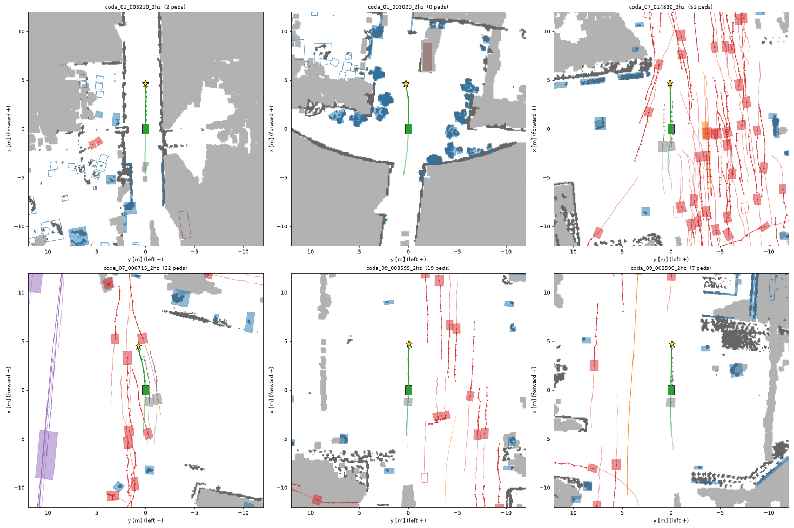

# Robot Navigation Open Scenarios: CODa

Image-in, trajectory-out navigation scenarios with 3D ground truth, for evaluating a
navigating robot (the intended use is humanoid navigation). Converted from the
[UT Campus Object Dataset (CODa)](https://amrl.cs.utexas.edu/coda/).

Each scenario has two halves:

- **Input, the past.** Front-camera images of the 10 past frames and the current frame, plus the
  robot's own past positions. No obstacle information.
- **Ground truth, the future.** The robot's recorded trajectory over the 10 future frames, and for the
  current and each future frame the 3D geometry around it: boxes of every labelled object (class,
  static or dynamic) and a lidar point cloud with every point tagged ground / static / dynamic.

A model predicts the robot's 10 future positions from the images. The evaluator scores whether that
path runs into anything in the future geometry. Code: <https://github.com/naomili0924/qwen_robotics_open_dataset>.



*Three test scenarios (`coda_2hz`). Left: the current image with the recorded future path drawn on the
ground. Middle: bird's-eye view with the static map (dark = occupied), object boxes and their future
tracks (red pedestrians, orange cycles, purple vehicles, blue static objects, grey operator), ego in
green, goal as a star. Right: the lidar points of the last future step (black static, red dynamic).*

## Configurations

| Config | Step | Past + future | Scenario spacing | train / validation / test |
|---|---|---|---|---|
| `coda_2hz` (default) | 0.5 s | 5 s + 5 s | 1 s | 1,547 / 86 / 322 |
| `coda_10hz` | 0.1 s | 1 s + 1 s | 1 s | 1,952 / 148 / 503 |

Every scenario has 21 steps: indices 0-9 past, 10 current, 11-20 future. `coda_10hz` matches Waymo's
10 Hz sampling, but a 1 s horizon is too short to separate planners on collisions (see baselines).
**Use `coda_2hz` for navigation evaluation.**

Splits are by whole CODa sequence: validation = sequences 4, 10, 19; test = 1, 7, 9, 12, 17;
train = the rest. The same campus routes recur across sequences, so places (not recordings) repeat
across splits. A scenario is about 7 MB; use streaming or one shard at a time.

## Quick start

```python
from datasets import load_dataset
import numpy as np

ds = load_dataset("Jinyan0924/qwen_robotics_open_dataset", "coda_2hz", split="test", streaming=True)
row = next(iter(ds))

images = row["past_images"]                                   # 11 PIL images, oldest first, last = current
ego = np.stack([row["ego"]["x"], row["ego"]["y"]], axis=1)    # (21, 2)
past_xy, future_xy = ego[:11], ego[11:]                       # model input / ground truth

boxes_x = np.array(row["future_tracks"]["x"], dtype=float)    # (objects, 11): step 0 = current
pts = row["future_lidar"]
step = 5                                                      # 5 steps after the current one
xyz = np.stack([pts["x"][step], pts["y"][step], pts["z"][step]], axis=1) / 100.0   # metres
label = np.array(pts["label"][step])                          # 0 ground, 1 static, 2 dynamic
```

Scoring predictions (with the code repository checked out):

```bash
python scripts/evaluate.py --repo Jinyan0924/qwen_robotics_open_dataset --config coda_2hz \
    --split test --pred my_predictions.json        # {"<scenario_id>": [[x, y] * 10], ...}
```

## Coordinate frame

Everything is in one frame per scenario: the robot's own frame at the current step, lowered to the
ground. Origin on the ground under the robot, **+x forward, +y left, +z up** (along the robot's up
axis), metres and radians; `heading` is counter-clockwise from +x. It is a rigid transform of CODa's
world frame, given as `world_from_scenario` (row-major 4x4).

## Columns

| Column | Type | Meaning |
|---|---|---|
| `scenario_id` | string | `coda_<sequence>_<frame of current step>_<rate>hz` |
| `dataset`, `sequence`, `segment` | string, string, int | source dataset, CODa sequence, index of the contiguously labelled segment |
| `rate_hz`, `current_time_index` | float, int | steps per second (2 or 10); always 10 |
| `timestamps`, `source_frames` | float64[21], int[21] | Unix time and CODa frame index of each step |
| `world_from_scenario` | float64[16] | scenario frame to CODa world frame |
| **Input** | | |
| `past_images` | image[11] | rectified front-left camera (`cam0`), 1224 x 1024 JPEG, steps 0-10 (oldest first, last = current) |
| `camera` | struct | `name`, `width`, `height`, `K` (row-major 3x3 intrinsics), `T_scenario_from_camera` (one row-major 4x4 per image: pose of the camera, x right / y down / z forward, in the scenario frame) |
| `ego` | struct | `x, y, z, heading, vx, vy` (each float[21]) and `length, width, height` of the recording robot (0.99 x 0.67 x 1.0 m). Steps 0-10 are input; **steps 11-20 are the recorded path, i.e. ground truth.** |
| `goal` | float[2] | ego (x, y) at the last future step |
| **Ground truth** | | |
| `future_tracks` | struct of lists | labelled objects at the current and future steps, see below |
| `tracks_to_predict` | int[] | indices of movable, non-operator objects present at the current step and later |
| `future_lidar` | struct of lists | lidar points at the current and future steps, see below |
| `static_map` | image | bird's-eye static obstacle map from lidar within +-5 s of the current step |
| `map_resolution` | float | 0.1 m per pixel |
| `num_tracks`, `num_pedestrians` | int | objects in `future_tracks`; non-operator pedestrians present at the current step |
| `ego_speed`, `ego_future_distance` | float | ego speed at the current step (m/s); recorded path length over the future (m) |

Nothing under "Ground truth" may be fed to a model being evaluated: it is all measured at or after
the current step, much of it in the future.

### `future_tracks`: boxes

Per-step arrays have 11 entries: **index 0 is the current step**, 1-10 the future steps.

| Field | Shape | Meaning |
|---|---|---|
| `id` | [N] | source instance id; a `#k` suffix marks a track that was split because the source reused the id |
| `category` | [N] | CODa class name (52 classes, e.g. `Pedestrian`, `Bike`, `Pole`, `Tree`) |
| `object_type` | [N] | `PEDESTRIAN`, `CYCLE`, `VEHICLE`, `OTHER_MOVABLE`, or `STATIC` |
| `length`, `width`, `height` | [N] | box size |
| `is_stationary` | [N] | **static vs dynamic:** true for `STATIC` types, and for movable objects seen for at least 3 steps over at least 1 s that stay within 0.25 m of their median position |
| `is_operator` | [N] | the robot's human operator, who walks next to it (see Limitations) |
| `x`, `y`, `z`, `heading` | [N, 11] | box centre and yaw per step, NaN where not valid |
| `vx`, `vy` | [N, 11] | velocity |
| `valid` | [N, 11] | whether the object is labelled at that step |
| `occlusion` | [N, 11] | CODa occlusion label: 0 none, 1 light, 2 medium, 3 heavy, 4 full, 5 unknown, -1 not valid |

### `future_lidar`: points

One point cloud per step (index 0 = current step), taken from the lidar sweep of that step and
expressed in the scenario frame. Each field is a list of 11 arrays of equal length within a step.

| Field | Type | Meaning |
|---|---|---|
| `x`, `y`, `z` | int16 | position in **centimetres**; z is height above the ground under the robot |
| `label` | uint8 | **0 = ground, 1 = static obstacle, 2 = dynamic object** |
| `track` | int16 | index into `future_tracks` of the box containing the point, or -1 |

Points within 20 m of the origin and up to 3 m above the ground are kept, thinned to one per 0.1 m
voxel (0.25 m cell for ground). A point inside the box of an object that is not stationary is dynamic;
everything else above the ground is static, including unlabelled structure such as walls and kerbs.
A step shows only what the sensor saw at that instant, so surfaces hidden behind something are absent.

### `static_map`

400 x 400 pixels, 0.1 m per pixel, 20 m around the ego. **0 = occupied, 255 = observed free ground,
127 = unknown.** Ego at the image centre, +x up, +y left:
`x = 20 - (row + 0.5) * 0.1`, `y = 20 - (col + 0.5) * 0.1`.
Occupied means lidar returns 0.2-2.0 m above the ground that persist for at least 2 s. Movable
objects are cut out; they are in `future_tracks`.

## Evaluation protocol

`hnod/eval.py` scores 10 predicted future (x, y) positions. The agent is a disc of radius 0.3 m
(configurable); paths are checked every 0.1 s, interpolating between steps.

- **dynamic**: moving boxes at their recorded future poses. Pedestrians count as discs of radius 0.3 m
  (their labelled boxes are loose, about 1 m across).
- **static**: stationary movable objects (standing people, parked bikes and cars), held where last seen.
- **map**: occupied cells of `static_map`. Boxes of `STATIC`-type objects are skipped when the map is
  used, since the map holds their true ground-level footprint.
- **lidar** (reported separately as `collided_lidar`): at the moment the path reaches a place, the
  sweep of that step has at least 3 non-ground points within the agent radius between 0.25 m and
  1.9 m above the ground. This catches moving things nobody labelled, but sees only one instant.
- Ignored: the operator, anything already overlapping the ego at the current step, boxes whose
  underside is more than 2 m up.
- `collided` = dynamic or static or map. Also reported: ADE and FDE against the recorded path, time of
  first collision, fraction of the path in unknown map cells.

Baselines on the test split (collision rates in %, ADE/FDE in m):

| `coda_2hz` (5 s horizon) | any | dynamic | static | map | lidar | ADE | FDE |
|---|---|---|---|---|---|---|---|
| recorded path (`expert`) | 0.9 | 0.3 | 0.0 | 0.6 | 0.0 | 0.00 | 0.00 |
| `constant_velocity` | 4.3 | 1.9 | 0.0 | 2.5 | 5.3 | 0.22 | 0.47 |
| `straight_to_goal` | 3.7 | 0.3 | 0.0 | 3.7 | 0.6 | 0.07 | 0.00 |
| `stationary` | 8.4 | 8.4 | 0.0 | 0.0 | 6.5 | 2.52 | 4.58 |

| `coda_10hz` (1 s horizon) | any | dynamic | static | map | lidar | ADE | FDE |
|---|---|---|---|---|---|---|---|
| recorded path (`expert`) | 0.2 | 0.2 | 0.0 | 0.0 | 0.0 | 0.00 | 0.00 |
| `constant_velocity` | 0.2 | 0.2 | 0.0 | 0.0 | 0.0 | 0.03 | 0.06 |
| `straight_to_goal` | 0.2 | 0.2 | 0.0 | 0.0 | 0.0 | 0.02 | 0.00 |
| `stationary` | 1.6 | 1.6 | 0.0 | 0.0 | 1.4 | 0.49 | 0.89 |

The recorded path did not hit anything, so its rates are the label-noise floor of the benchmark;
differences smaller than that are not meaningful.

## How it was built

1. **Labels.** CODa's 3D boxes (27,863 frames at 10 Hz in 21 sequences), poses and timestamps.
2. **Segments.** CODa is labelled in bursts of consecutive frames; ids are only consistent inside a
   burst. Each burst is one segment (83 in total).
3. **Track clean-up.** Garbage boxes are dropped; a track is split where consecutive observations are
   further apart than its type can move, because ids are sometimes reused.
4. **Images.** The rectified `cam0` PNGs of the labelled frames, re-encoded as JPEG (quality 90).
   Projecting lidar and box centres with the published calibration lands on the right objects.
5. **Lidar.** Each sweep is split into ground and non-ground by growing a ground surface outwards from
   the robot. Checked against CODa's terrain labels (4,980 frames): on paved and tiled surfaces 99.1%
   of points are classified as ground and 0.16% as obstacle; grass is the exception (see Limitations).
6. **Scenarios.** Sliding windows over each segment in the robot frame of the current step. Windows
   that need one of the 10 frames without image or sweep are left out.

## Limitations

- **Not recorded by a humanoid.** A wheeled Clearpath Husky, camera and lidar about 0.8 m above the
  ground, teleoperated at about 0.9 m/s.
- **Open loop.** Other agents replay their recorded motion and do not react to the predicted path.
- **One forward camera.** Things behind or beside the robot are in the ground truth but not in the
  images; a model cannot be expected to foresee them.
- **Operator.** One or two people walk right next to the robot throughout CODa. They are flagged
  `is_operator` by a heuristic (a pedestrian that stays within 2.5 m) and ignored by the evaluator; the
  heuristic can miss one or flag a bystander. Their lidar points are excluded only when they are in a
  labelled operator box.
- **Derived geometry.** Ground/obstacle labels on lidar points come from a heuristic, not from
  annotation. Lawns are often marked as obstacle (45% of grass points: mostly raised or banked lawns,
  and tall grass). Stairs and slopes steeper than about 40% are partly marked as obstacle; drop-offs
  are not detected.
- **Label noise.** Boxes are hand-labelled and loose, which is why pedestrians are evaluated as discs.
- **Poses.** Sequences 8, 14 and 15 only have odometry-quality poses (locally consistent, which is what
  a 2-10 s scenario needs). CODa sequences 21 and 22 have no labels and are not included.

## Other sources

| Dataset | Status | Reason |
|---|---|---|
| RoboSense | converted | [Jinyan0924/qwen_robotics_open_dataset_robosense](https://huggingface.co/datasets/Jinyan0924/qwen_robotics_open_dataset_robosense) |
| SiT | blocked | The download link is issued only after signing the authors' terms-of-use form. Their README says CC BY-NC-ND (no derivatives) while the form says CC BY-NC-SA, so whether converted data may be shared needs their confirmation. |
| JRDB | converted | [Jinyan0924/qwen_robotics_open_dataset_jrdb](https://huggingface.co/datasets/Jinyan0924/qwen_robotics_open_dataset_jrdb) (pedestrians only; moving-robot sequences; odometry refined by scan matching) |
| SCAND | no | No object labels of any kind (the authors say so), only coarse per-trajectory tags, so there is no ground truth for future obstacles. |
| MuSoHu | no | Same: no boxes or tracks. Recorded from a helmet on a walking person. |

## License and attribution

Adapted from CODa and released under the same license,
[CC BY-NC-SA 4.0](https://creativecommons.org/licenses/by-nc-sa/4.0/) (non-commercial, share-alike).
Changes from the original: images were re-encoded; labels were re-sampled into fixed-length
ego-centric windows; tracks were cleaned; velocities and static/dynamic flags were derived; lidar
sweeps were thinned, labelled and merged into obstacle maps. If you use this data, cite CODa:

```bibtex
@misc{zhang2023robust,
  title={Towards Robust Robot 3D Perception in Urban Environments: The UT Campus Object Dataset},
  author={Arthur Zhang and Chaitanya Eranki and Christina Zhang and Ji-Hwan Park and Raymond Hong and Pranav Kalyani and Lochana Kalyanaraman and Arsh Gamare and Arnav Bagad and Maria Esteva and Joydeep Biswas},
  year={2023},
  eprint={2309.13549},
  archivePrefix={arXiv},
  primaryClass={cs.RO}
}
```

Dataset DOI: [10.18738/T8/BBOQMV](https://doi.org/10.18738/T8/BBOQMV).
