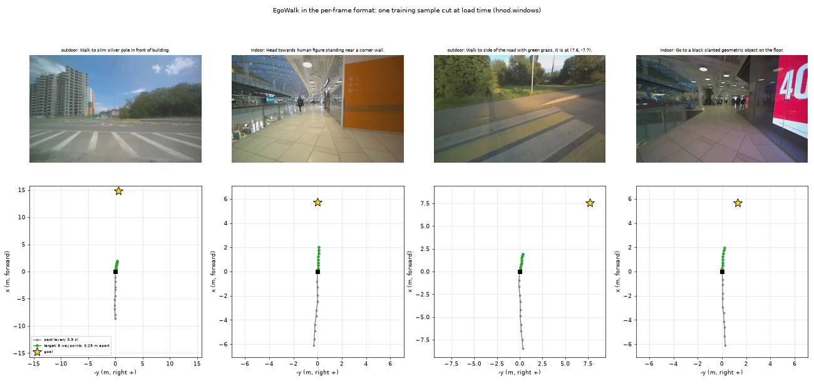

# EgoWalk navigation frames

[EgoWalk](https://huggingface.co/datasets/EgoWalk/trajectories) (MIT) converted into a per-frame training
format for **image-in, trajectory-out navigation policies**: 57 hours and 232 km of people walking
in Moscow, indoors (malls, stations, offices) and outdoors, filmed by a chest-mounted ZED camera, with
visual odometry and about 79,000 language goals ("Walk to the glass door on the left").

It is one of the training sources of [qwen_robotics_open_dataset](https://github.com/naomili0924/qwen_robotics_open_dataset),
which builds training data usable by both Qwen-RobotNav-style and Qwen-VLA-style models from open
datasets. Conversion code: `scripts/convert_egowalk.py`.



*Top: the current frame and a prompt made at load time. Bottom: the same sample in the walker's frame:
past positions, the 8 target waypoints taken every 0.25 m along the path, and the goal.*

## What is in it

| Split | Recordings | Episodes | Frames | Hours | km | Indoor frames | Language segments |
|---|---|---|---|---|---|---|---|
| train | 215 | 738 | 905,403 | 50.3 | 202.2 | 47% | 69,143 |
| validation | 9 | 37 | 37,713 | 2.1 | 9.7 | 36% | 2,881 |
| test | 15 | 51 | 89,863 | 5.0 | 19.8 | 43% | 7,058 |

- **Frames at 5 Hz, 960 × 600 RGB** (JPEG, quality 90, re-encoded from the source video), every frame of the
  source with a valid pose. Depth video is left out: the policy sees RGB only.
- **Poses**: x, y, z, yaw in metres / radians in the episode's odometry frame (z up), straight from the
  source's ZED visual odometry, not resampled or normalised. Yaw is the camera's heading; it matches the
  walking direction to within a few degrees.
- **Episodes**: a recording is cut wherever odometry failed (missing poses, re-initialisation jumps over 1 m,
  gaps over 1 s); episodes shorter than 20 frames or 3 m are dropped. 826 episodes from 239 recordings.
- **Language goals** (`episodes.segments`): both annotation sets of the source, `end2end` (VLM-written) and
  `goal_boxes` (detector-based). A segment's `instruction` names what the walker reaches at `end_frame`.
- **Indoor / outdoor**: estimated per frame with CLIP ViT-L/14 zero-shot (`frame_indoor_prob`); an episode is
  `indoor` / `outdoor` if at least 80% of its frames are, else `mixed`. Spot-checked by eye, not annotated.
- **Splits** are by recording (hash of its name), 90 / 5 / 5.
- **Walking speed**: median 1.2 m/s, much faster than a 0.5 m/s robot. Speed is deliberately not baked into
  anything stored; targets are cut by distance along the path at load time.

## The per-frame format

Two configs, joined by `episode_id`.

`frames`: one row per frame, rows of an episode contiguous and in time order.

| Column | Type | Meaning |
|---|---|---|
| `episode_id` | string | `egowalk/<recording>/<nn>` |
| `frame_index` | int32 | 0-based within the episode |
| `source_frame` | int32 | frame number in the source recording |
| `timestamp` | float64 | seconds since the episode's first frame |
| `image` | image | front camera (left camera of the ZED) |
| `image_right` | image | right camera of a stereo pair; None here (the source publishes the left only) |
| `pose` | float64[4] | x, y, z (m), yaw (rad), episode odometry frame, z up |

`episodes`: one row per episode.

| Column | Meaning |
|---|---|
| `dataset`, `source_sequence`, `split` | origin |
| `num_frames`, `rate_hz`, `duration_s`, `path_length_m`, `median_speed_mps` | size and speed |
| `embodiment` | `person_walking` |
| `environment`, `environment_method`, `indoor_fraction`, `frame_indoor_prob` | indoor / outdoor estimate, per episode and per frame |
| `camera` | name, width, height, `K` (row-major 3 × 3), `distortion_model` (`opencv_rational`), `distortion` (k1 k2 p1 p2 k3 k4 k5 k6), `height_m` above the ground (1.20–1.36 m), `stereo_baseline_m` |
| `segments` | language goals: `start_frame`, `end_frame`, `task`, `instruction`, `brief`, `source` |
| `ends_at_rest` | the episode ends with the walker standing still (a real "stop here"); false at odometry cuts |
| `fits` | `both` (has language goals: usable for Qwen-RobotNav and Qwen-VLA style training) or `robotnav` |
| `licence` | source licence |

## Load and cut training samples

```python
from datasets import load_dataset
from hnod.windows import FrameWindows, WindowConfig   # github.com/naomili0924/qwen_robotics_open_dataset

repo = "Jinyan0924/qwen_robotics_open_dataset_egowalk"
frames = load_dataset(repo, "frames", split="validation")     # train is 76 GB
episodes = load_dataset(repo, "episodes", split="validation")
samples = FrameWindows(frames, episodes, WindowConfig(n_waypoints=8, spacing_m=0.25))
s = samples[0]
s["images"]   # 11 PIL images: the current frame and one every 0.5 s before it
s["prompt"]   # "Please walk towards the goal (7.9, 2.6)." or "Walk to the glass door. It is at (3.0, 1.5)."
s["target"]   # (8, 3) waypoints x, y, yaw in the current frame: x forward, y left, metres
s["stop"]     # (8,) true past the end of an episode that ends at rest
```

Samples are cut at load time, so horizon, waypoint spacing, history length and the share of language prompts
are parameters, not properties of the data. Point goals lie 4–20 m further along the walked path (beyond the
waypoint horizon, so the goal does not give away the answer); language goals are the end of a segment that is
still at least the horizon ahead. Standing-still odometry jitter (under 5 cm) does not count as travel.

## Limitations

- **A person, not a robot.** Camera at chest height (about 1.3 m), walking at about 1.2 m/s, through places
  and gaps a robot may not fit. No obstacle ground truth, so it is training data only, never evaluation data.
- **Odometry, not ground truth.** ZED visual odometry drifts and sometimes fails (hence the episode cuts).
- **Wide-angle lens** with strong distortion (rational model given in `camera`); images are not undistorted.
- **Indoor / outdoor labels are estimates** (CLIP), roughly right by spot check; mixed scenes (covered
  walkways, station entrances) are uncertain.
- **Language goals are machine-written** by the source authors (VLM and detector pipelines) and not verified.

## Licence and citation

EgoWalk is MIT-licensed; this conversion keeps the MIT licence. Cite the EgoWalk authors
([dataset](https://huggingface.co/datasets/EgoWalk/trajectories), [API](https://github.com/egowalk/egowalk-dataset)).
