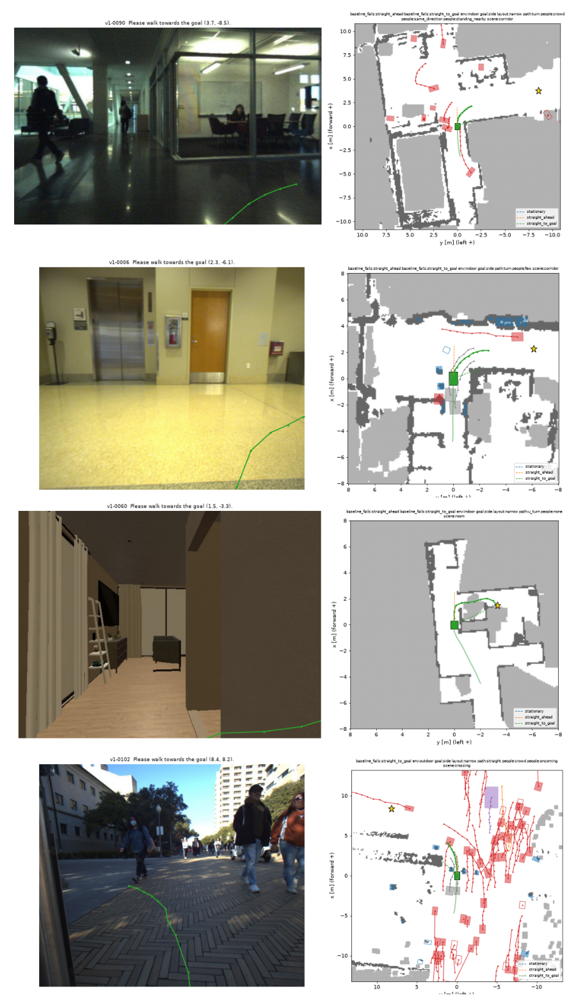
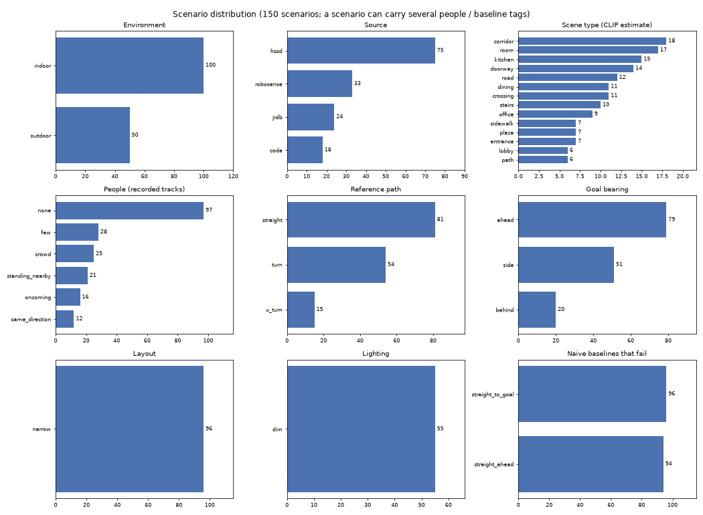

# Robot navigation evaluation suite (v2)

150 hand-audited scenarios for **image-in, path-out navigation policies of an indoor robot** (a walking
humanoid, about 0.5 m/s): 100 indoor and 50 outdoor, drawn from 4 open datasets, each with a text prompt
that contains the goal and 3D ground truth (lidar, tracked people, obstacle maps) for scoring. Built by
[qwen_robotics_open_dataset](https://github.com/naomili0924/qwen_robotics_open_dataset)
(`scripts/build_eval_suite.py`; design and decisions in `docs/eval_design.md`, every audit decision in
`docs/eval_audit_v2.json`).



*Each example: left, the current camera image with the recorded path; right, the bird's-eye view with the
static obstacle map (dark), people (red) with their future tracks, vehicles (purple), the recorded reference
path (green), the goal of the prompt (star) and the naive baselines (dashed).*

## Versions

| Version | Indoor | Outdoor | Notes |
|---|---|---|---|
| `v2` (default) | 100 real: 75 MuSoHu walks (mall, university buildings), 17 JRDB, 8 CODa | 50 real | all scenarios real recordings with people |
| `v1` | 25 real (CODa, JRDB) + 75 simulated HSSD houses without people | 50 real | the same 50 outdoor and 25 real indoor scenarios as v2 |

v2 is easier for naive planners than v1: walking straight to the goal succeeds in 69% of v2's indoor scenarios and
20% of v1's, because real indoor walks are mostly corridors and halls with a clear line of sight, while the simulated
houses force turns through doorways. Report both versions while v2 is the only all-real indoor set.

## Protocol

- **Input the model may use:** `past_images` (current + 10 past front-camera frames, oldest first), the robot's
  own past poses (`ego` x / y / heading at the past steps), the camera intrinsics, and `prompt`, e.g. "Please
  walk towards the goal (7.9, 2.6)." Coordinates: metres in the robot frame at the current moment, robot at
  (0, 0), x forward, y left. **Never** the lidar, maps, tracks or the future part of `ego`: those are ground truth.
- **Output:** a path, a list of (x, y) points in the same frame, any length and spacing.
- **Execution:** the robot follows the path at **0.5 m/s** with perfect control over the scenario's horizon
  (5 s for UT CODa, 4 s for JRDB, 5 s for MuSoHu, 10 s for RoboSense); a path that ends early means it stops there.
- **Scores** (`hnod/suite.py`):
  - `collided`: hits a standing person or object, the static map (with a 5 cm tolerance for the 10 cm map grid),
    or, **at fault**, a moving person or vehicle: the robot is moving and the agent is ahead of it at first contact.
    Recorded people do not react to the robot, so being walked into is not counted (as in nuPlan).
  - `progress_ratio`: distance gained towards the goal over the most a perfect path could gain (1 = straight
    at full speed); `path_efficiency`: distance gained per metre walked.
  - `success`: no collision and `progress_ratio` >= 0.5.
  - `wiggle_rad`: heading oscillation (total minus net turning); turning in place is not penalised.
  - `reference_deviation_m`: distance to the recorded reference path, compared by distance along the path. Secondary:
    several paths can be good.
  - `collided_lidar` (raw lidar points) and `unknown_fraction` (share of the path over unobserved ground) are
    reported separately.

```bash
python scripts/evaluate_suite.py --pred my_predictions.json     # {"v2-0000": [[x, y], ...], ...}
python scripts/evaluate_suite.py --baseline straight_to_goal
python -m vla.predict_suite --checkpoint runs/<run>/last --out preds.json   # a policy trained with vla/
```

## Scenario distribution



| Environment | Source | Scenarios |
|---|---|---|
| indoor | coda | 8 |
| indoor | jrdb | 17 |
| indoor | musohu | 75 |
| outdoor | coda | 10 |
| outdoor | jrdb | 7 |
| outdoor | robosense | 33 |

**Environment**

| | Scenarios | Share |
|---|---|---|
| indoor | 100 | 67% |
| outdoor | 50 | 33% |

**People around the robot** (from the recorded tracks; a scenario can have several interaction tags)

| | Scenarios | Share |
|---|---|---|
| few | 69 | 46% |
| none | 42 | 28% |
| crowd | 39 | 26% |
| oncoming | 28 | 19% |
| standing_nearby | 21 | 14% |
| same_direction | 13 | 9% |
| crossing | 2 | 1% |

**Reference path and goal**

| | Scenarios | Share |
|---|---|---|
| path: straight | 123 | 82% |
| path: turn | 21 | 14% |
| path: u_turn | 6 | 4% |
| goal: ahead | 109 | 73% |
| goal: side | 33 | 22% |
| goal: behind | 8 | 5% |

**Scene type** (CLIP zero-shot on the current image; indoor and outdoor vocabularies)

| | Scenarios | Share |
|---|---|---|
| lobby | 39 | 26% |
| corridor | 38 | 25% |
| dining | 19 | 13% |
| road | 12 | 8% |
| crossing | 11 | 7% |
| sidewalk | 7 | 5% |
| plaza | 7 | 5% |
| entrance | 7 | 5% |
| path | 6 | 4% |
| doorway | 2 | 1% |
| office | 1 | 1% |
| hall_crowd | 1 | 1% |

**Conditions:** narrow passage (reference passes within 35 cm of an obstacle) in 64,
dim lighting in 9. **Difficulty:** "walk straight ahead" fails in
39 and "walk straight to the goal" in
47 of the 150 scenarios.

## Baselines

Success / collision rate / progress ratio, robot speed 0.5 m/s.

| Planner | All | Indoor | Outdoor |
|---|---|---|---|
| reference | 0.90 / 0.00 / 0.83 | 0.91 / 0.00 / 0.84 | 0.88 / 0.00 / 0.80 |
| stationary | 0.00 / 0.00 / 0.00 | 0.00 / 0.00 / 0.00 | 0.00 / 0.00 / 0.00 |
| straight_ahead | 0.74 / 0.11 / 0.75 | 0.78 / 0.08 / 0.79 | 0.66 / 0.18 / 0.66 |
| straight_to_goal | 0.69 / 0.31 / 1.00 | 0.69 / 0.31 / 1.00 | 0.68 / 0.32 / 1.00 |

`reference` follows the recorded path (a person driving the robot, or the simulator's shortest-path planner):
every scenario is solvable by construction, but the reference is not optimal for the goal of the prompt, so its
success is below 1. Naive planners collide often indoors: the set needs perception, not only the goal.

## How it was built

1. **Candidates, all held out from training:** CODa `coda_2hz` test + validation, JRDB `jrdb_2.5hz` (all of
   JRDB is reserved for evaluation), RoboSense `robosense_1hz` validation, HSSD `hssd_2hz` test + validation
   houses, and MuSoHu indoor walks (all of it reserved; people tracked in its lidar, not annotated). The per-frame
   training configs of these sources publish only their train splits.
2. **Goal:** a point on the recorded reference path 3–10 m beyond the end of the scored horizon (the end of the
   episode for simulated ones), at least 2 m away, so the goal does not give away the answer.
3. **Validity:** the reference path, followed at 0.5 m/s, is collision-free and does not reverse; the reference
   is at most 30% over unobserved ground; nothing overlaps the robot at the start; nobody walks through a robot
   that stands still.
4. **Environment:** every real candidate not clearly outdoor by CLIP was labelled by eye (courtyards and
   covered walkways count as outdoor); simulated candidates must look indoor to CLIP with >= 0.95 and must not
   show the black background of an open sky (HSSD point-goal episodes partly run through gardens).
5. **Selection:** real scenarios first; then tag coverage, then scenarios where naive baselines fail; at most 15
   per real recording and 4 per simulated house, 5 s apart within a recording, no near-duplicate views.
6. **Audit:** every scenario was inspected on its audit image; rejected ones (with reasons) and accepted ones are
   listed in `docs/eval_audit_v2.json`, and re-running the selection reproduces this set.

## Columns

The scenario schema of the source datasets (`past_images`, `ego`, `future_tracks`, `future_lidar`,
`static_map`, `camera`, ...; see the [CODa card](https://huggingface.co/datasets/Jinyan0924/qwen_robotics_open_dataset))
plus: `suite_id`, `suite_version`, `prompt`, `environment`, `scene`, `tags`, `source`, `source_repo`,
`source_config`, `source_split`, `reference` (`teleoperated_robot` or `shortest_path_planner`), `goal_extra_m`.
`goal` is the goal of the prompt (not the end of the recorded future, unlike the source datasets).

## Limitations

- **Indoor scenes:** 100 of the 100 indoor scenarios are real recordings.
  MuSoHu people are tracked in its lidar, not annotated: missed or spurious people are possible.
- **Open loop and non-reactive.** People in recordings do not react to the robot; the at-fault rule removes the
  worst artefacts, but interactions are not closed loop. Simulated scenarios could be run closed loop in Habitat.
- **Small.** With 150 scenarios, two planners must differ by roughly 10–15 points in collision rate to be told apart
  reliably on one binary metric; continuous scores and paired comparisons help.
- **Estimated tags.** Scene types are CLIP estimates; people tags come from the source's tracks.
- **Different embodiments.** Recordings come from wheeled robots (camera 0.7–0.8 m high), a walking person's
  helmet (MuSoHu, about 1.7 m) and a simulated agent: camera height and field of view vary on purpose.

## Licence

Each scenario keeps its source's licence, all non-commercial; see `LICENSE.md`:

| Source | Licence |
|---|---|
| coda | CC BY-NC-SA 4.0 (UT CODa) |
| jrdb | CC BY-NC-SA 3.0 (JRDB) |
| musohu | CC0 (MuSoHu) |
| robosense | CC BY-NC-SA 4.0 (RoboSense) |

Cite the source datasets: UT CODa, JRDB, MuSoHu, RoboSense.
